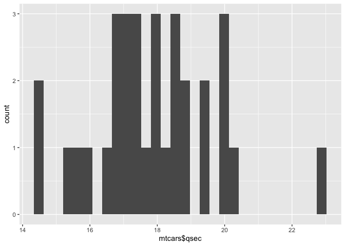

<!-- README.md is generated from README.Rmd. Please edit that file -->

# EDAStat

<!-- badges: start -->
<!-- badges: end -->

The goal of the EDAStat package is to facilitate Exploratory Data
Analysis (EDA) by providing functions to generate summary statistics and
appropriate plots for a given dataset. It helps users understand their
data by calculating outliers, identifying missing values, and creating
visualizations.

## Installation

You can install the development version of EDAStat from
[GitHub](https://github.com/) with:

``` r
# install.packages("devtools")
devtools::install_github("nataliesz/summarystuff")
```

Make sure to install the required dependencies (dplyr, ggplot2, stats)
before installing EDAStat.

## Usage

Given a variable and a dataset, summary_stats() function from the
EDAStat package generates a statistical summary of the variable and
provides that summary output in a list format.

``` r
library(EDAStat)

summary_stats(mtcars$mpg, mtcars)
#>    min     q1 median     mean   q3  max       sd n_missing rate_missing
#> 1 10.4 15.425   19.2 20.09062 22.8 33.9 6.026948         0            1
```

The EDAStat package function distribution() can generate a histograms of
a specified variable and display the graphin the Plots section of
RStudio

``` r
distribution(mtcars$qsec, mtcars)
#> `stat_bin()` using `bins = 30`. Pick better value with `binwidth`.
```



## License

`EDAStat` is licensed under the MIT License. See the [LICENSE](LICENSE)
file for details.
